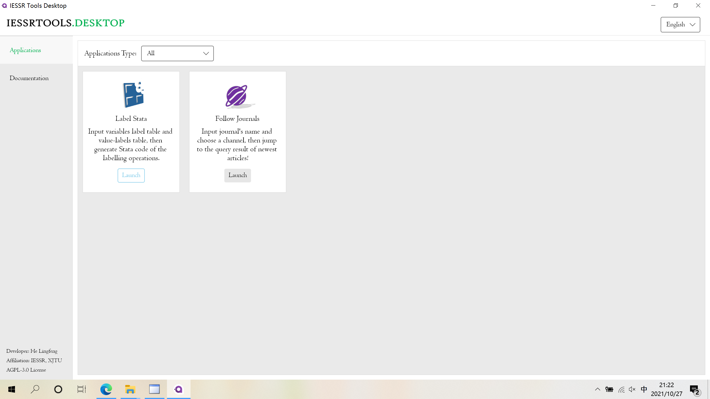
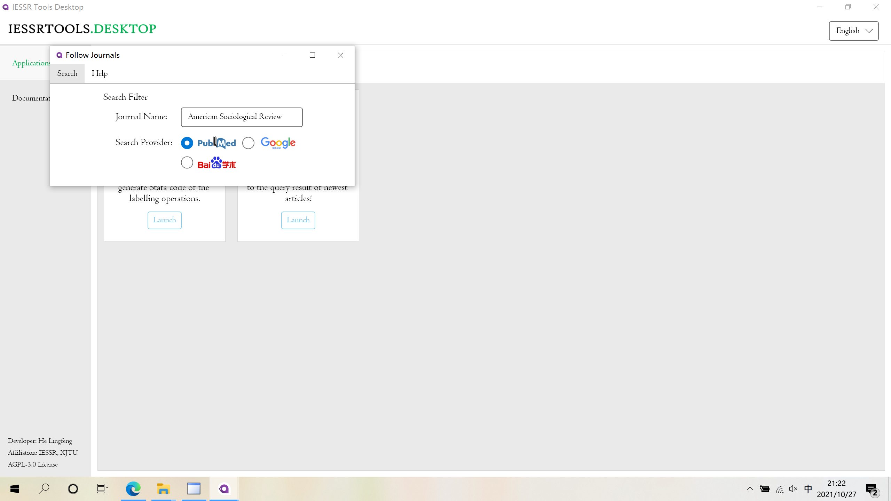
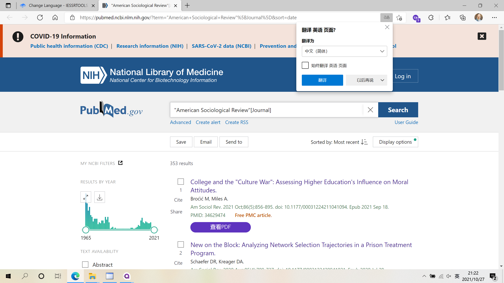

# Follow Journal

## Getting Started

The tool is under the "Application" tab. Click "Launch" to launch the tool.

## Usage

Type the journal's name and choose a search provider. Click "Search" button on the menu bar, then the query result will be shown in your default browser.

