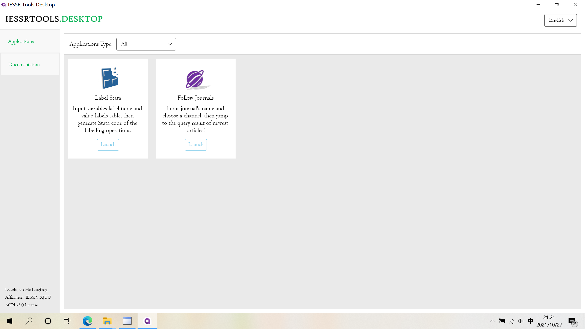
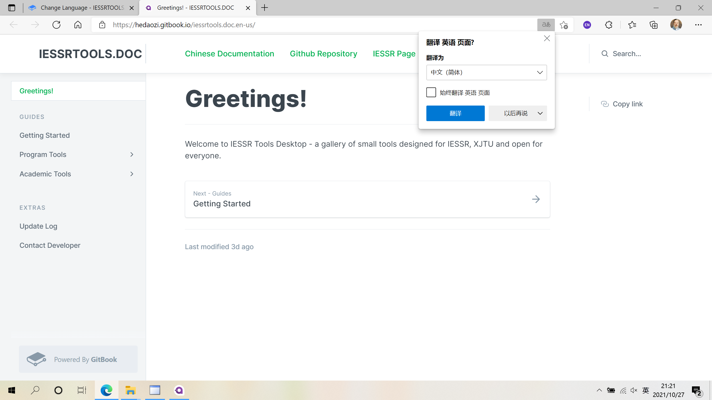

# Help Files

## Documentation

The first way to read help files is click "Documentation" button in the main windows' navigator, which is shown below.

Once you click the button, a new page will be opened in your default browser.


The language of shown documentation depends on your language of your interface. For language settings, see [Change Language](change-language.md).


## Tools Help

For each tool, there is a "Help" button in its menu bar.


Again, he language of shown documentation depends on your language of your interface. For language settings, see [Change Language](change-language.md).

