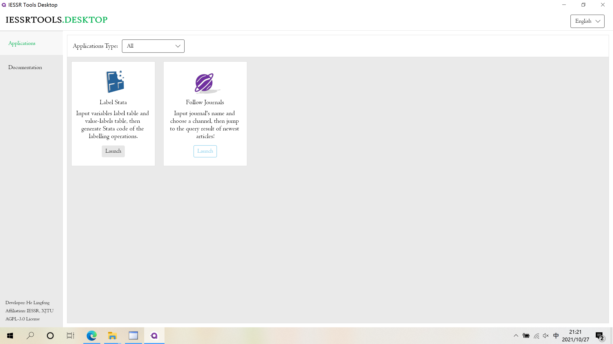
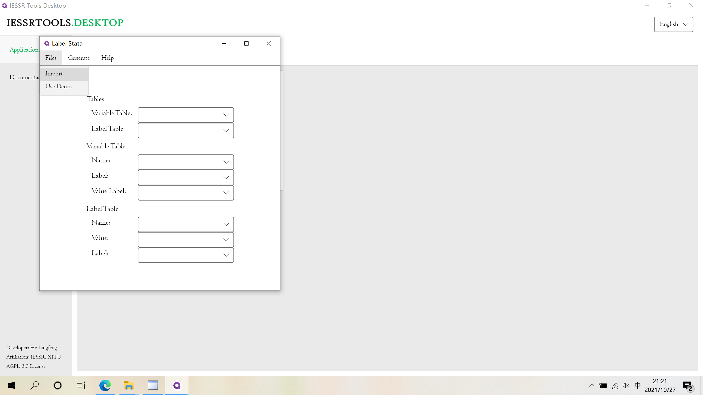
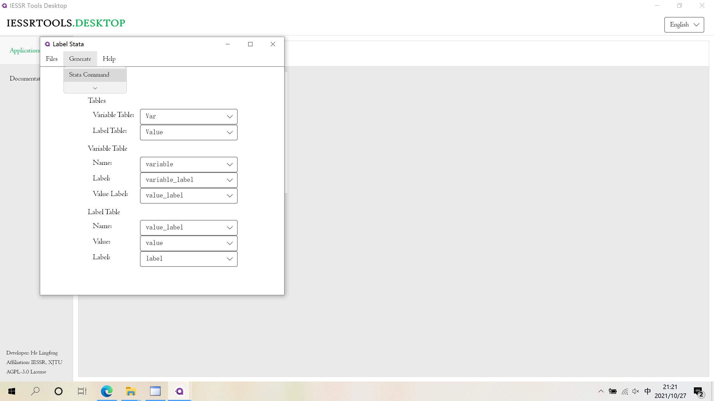
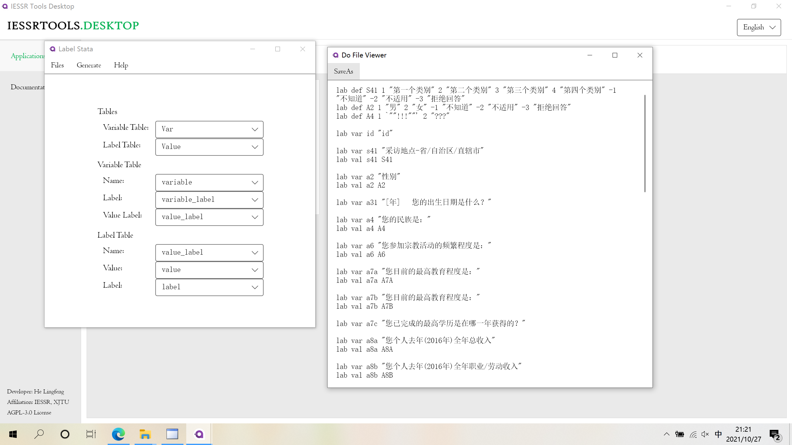
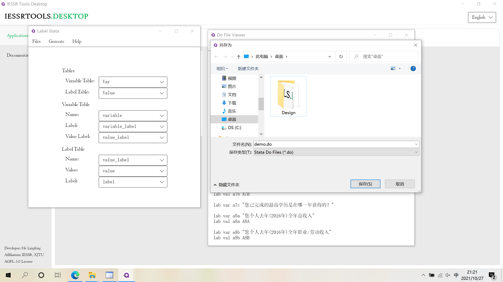

# Label Stata

## Getting Started

The tool is under the "Application" tab. Click "Launch" to launch the tool.

## Usage


Before using this tool, you should prepare a .xlsx file contains **both variable label table and value label table**.

In variable label table, there must be 3 columns, which provides name, label and value label of variable. The name is required for each row and label and value label is optional.&#x20;

In value label table, there must be 3 columns, which provides the name, the value and the label of value labels. All are required.

For instance, consider you have a variable named as `A1`, which means gender of respondents. And you label 1 as male and 2 as female and store the label with name `A1_LAB`.&#x20;

In that case, `A1` is the name of variable, "gender of respondents" is the label of variable and `A1_LAB` is the value label of variable. These information should be included in variable label table. And for value label table, you should type 2 rows in excel. The first row is like `(A1_LAB, 1, Male)` and the second row is like `(A1_LAB, 1, Female)`. Remember that **the value label name in two table should be corresponding**.

The names of sheets and columns are arbitrary.

**Each sheet must contain a heading row.**



If you are still confused about the content of .xlsx file, you can see a demo by clicking "Use Demo" located under menu item "Files".


### Step 1 Import .xlsx File

Click "Files -> Import" to import the .xlsx file.


Please ensure the file is not opened by other process, especially Microsoft Excel.


### Step 2 Configure

Choose sheets and columns.

### Step 3 Generate Stata Command

Click "Generate -> Stata Command" to generate Stata command. After that, you will see a window which is shown below. Click "Save As" to save the command into a local .do file.


You can edit Stata command is this window. And all your change will save to file when you click "Save As" to save the command.

